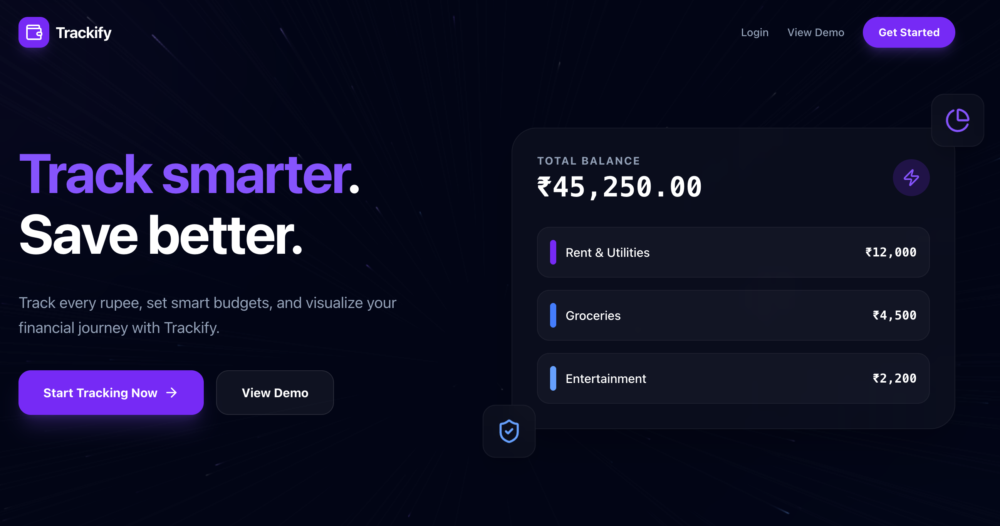
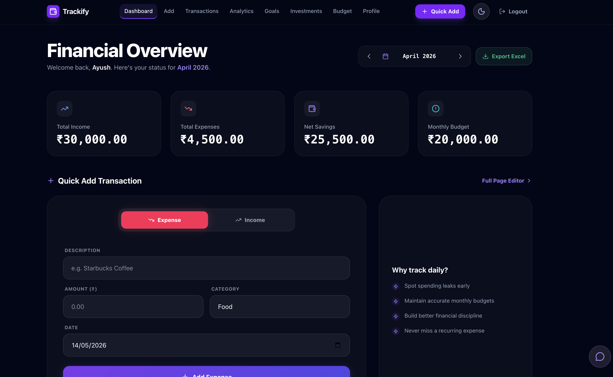
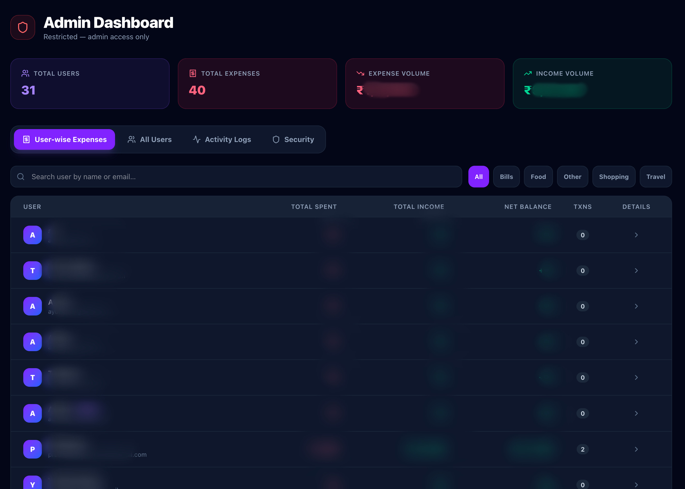
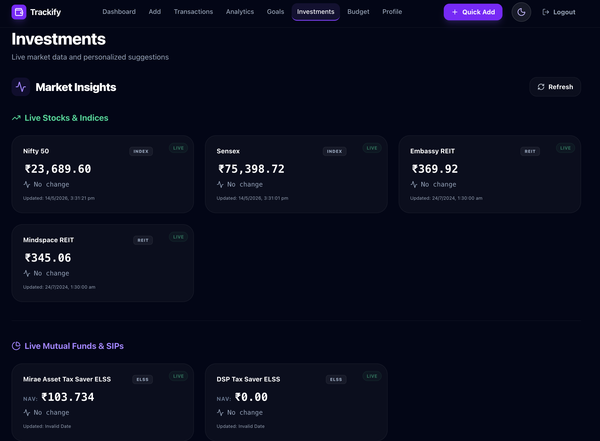

# Trackify 💰

> Track smarter. Save better.

A smart personal finance management web app built for Indian users — track expenses, set budgets, manage savings goals, view live market data, and get personalized financial advice through a Gemini-powered chatbot.

**Live Demo:** https://trackify-beta.vercel.app

---

## Screenshots

### Landing Page


### Dashboard


### Admin Dashboard


### Investments


---

## Features

### Core Features
- **Expense & Income Tracking** — Log transactions with auto-categorization using keyword mapping
- **Monthly Budget Management** — Set monthly budgets with visual progress and overspend alerts
- **Savings Goals** — Create goals, allocate savings, track progress with deadlines
- **Analytics** — Pie chart for expense distribution, bar chart for cash flow history
- **Excel Export** — Download monthly reports as `.xlsx` files
- **Month Navigation** — Switch between months to view historical data
- **Demo Mode** — Explore the app without registering

### Investment Features
- **Rule-based Investment Suggestions** — Personalized suggestions based on monthly savings tier
- **Live Stocks & Indices** — Real-time Nifty 50, Sensex, top Indian stocks via Yahoo Finance
- **Live Mutual Funds & SIPs** — Real-time NAV data via MFAPI India
- **Two separate sections** — Stocks/Indices and Mutual Funds displayed separately

### AI & Smart Features
- **Gemini Chatbot** — Powered by Google Gemini 2.0 Flash with user's financial context
- **Auto Categorization** — Keyword-based expense category detection

### Security & Admin
- **Role-based Access** — Admin and User roles
- **Admin Dashboard** — View all users, expenses, activity logs, security metrics
- **Activity Logging** — All login, logout, add and delete actions are logged
- **Suspicious Activity Detection**:
  - Account locked after 5 failed logins in 10 minutes
  - Excessive deletion alerts
  - Impossible login frequency detection
- **Security Dashboard** — Failed logins, active users, locked accounts, suspicious activity log
- **Google OAuth 2.0** — Sign in with Google
- **JWT Authentication** — Secure token-based sessions
- **Password Hashing** — bcrypt encryption

### UI/UX
- **Dark & Light Theme** — Smooth toggle with CSS variables
- **Responsive Design** — Works on mobile, tablet and desktop
- **Framer Motion Animations** — Smooth page and component transitions
- **Quick Add Button** — Add transactions directly from navbar
- **Welcome Banner** — Personalized greeting on first login per session

## Security & Audit Features

Trackify includes a built-in security monitoring and audit system designed to simulate real-world enterprise controls used in IT audit, SOC, and GRC environments.

### Authentication & Access Control
- JWT-based authentication system
- Google OAuth 2.0 login integration
- Role-based access control (Admin/User)
- bcrypt password hashing
- Protected admin-only routes

### Audit Logging
- Tracks login and logout activity
- Logs expense and income creation/deletion
- Stores timestamped user activity records
- Centralized admin activity monitoring dashboard

### Suspicious Activity Detection
- Detects excessive failed login attempts
- Automatically locks accounts after repeated failures
- Flags abnormal deletion activity
- Monitors impossible login frequency patterns
- Generates suspicious activity alerts with severity levels

### Session Monitoring
- Tracks active user sessions
- Records login time and last activity
- Displays currently active users
- Maintains recent session history

### Security Dashboard
Admin dashboard includes:
- Failed login metrics
- Active users monitoring
- Locked account tracking
- Suspicious activity logs
- Session activity analytics
- User-wise audit visibility

### Secure Infrastructure Practices
- Environment variable based secret management
- Restricted CORS configuration
- Secure API route protection
- Token-based session management
- Server-side validation and authorization checks


---

## Tech Stack

### Frontend
| Technology | Purpose |
|------------|---------|
| React 18 + TypeScript | Frontend framework |
| Vite | Build tool |
| Tailwind CSS | Styling |
| Framer Motion | Animations |
| Recharts | Charts and graphs |
| React Router v6 | Client-side routing |
| @react-oauth/google | Google OAuth |
| xlsx + file-saver | Excel export |
| lucide-react | Icons |

### Backend
| Technology | Purpose |
|------------|---------|
| Flask (Python) | REST API |
| PostgreSQL | Database |
| psycopg2 | Database driver |
| Flask-JWT-Extended | JWT authentication |
| Flask-Bcrypt | Password hashing |
| Flask-CORS | Cross-origin requests |
| Google Gemini API | Chatbot |
| Yahoo Finance API | Live stock data |
| MFAPI India | Mutual fund NAV data |
| ThreadPoolExecutor | Concurrent API fetching |

### Deployment
| Platform | Purpose |
|----------|---------|
| Vercel | Frontend hosting |
| Render | Backend hosting |
| Neon | Serverless PostgreSQL |
| GitHub | Version control + CI/CD |

---

## Architecture / Data Flow

### Application Flow

```text
Frontend (React + TypeScript)
        ↓
Flask REST API Backend
        ↓
PostgreSQL Database
```

### Authentication Flow

```text
User Login
    ↓
JWT Token Generated
    ↓
Token Stored in Frontend
    ↓
Protected API Requests
    ↓
Backend JWT Verification
```

### Gemini AI Flow

```text
User Financial Data
        ↓
Gemini AI API
        ↓
Personalized Financial Insights
        ↓
Chatbot Response in Frontend
```

### Market Data Flow

```text
Yahoo Finance API + MFAPI India
                ↓
Flask Market Routes
                ↓
Frontend Investment Dashboard
```

## Database Schema

```sql
users (id, name, email, password, role, account_locked_until, created_at)
expenses (id, user_id, title, amount, category, note, date)
income (id, user_id, title, amount, source, date)
budgets (id, user_id, limit_amount, month)
goals (id, user_id, name, target_amount, saved_amount, deadline)
logs (id, user_id, action, timestamp)
suspicious_activity (id, user_id, description, severity, resolved, timestamp)
```

---

## API Endpoints

### Authentication
| Method | Endpoint | Description |
|--------|----------|-------------|
| POST | /register | Register new user |
| POST | /login | Login with email/password |
| POST | /auth/google | Google OAuth login |

### Expenses
| Method | Endpoint | Description |
|--------|----------|-------------|
| GET | /expenses | Get expenses (own or all if admin) |
| POST | /expenses | Add expense |
| DELETE | /expenses/:id | Delete expense |

### Income
| Method | Endpoint | Description |
|--------|----------|-------------|
| GET | /income | Get income |
| POST | /income | Add income |
| DELETE | /income/:id | Delete income |

### Budget
| Method | Endpoint | Description |
|--------|----------|-------------|
| GET | /budget | Get budget for month |
| POST | /budget | Set monthly budget |

### Goals
| Method | Endpoint | Description |
|--------|----------|-------------|
| GET | /goals | Get all goals |
| POST | /goals | Create goal |
| PUT | /goals/:id | Update goal (add money) |
| DELETE | /goals/:id | Delete goal |

### Market Data
| Method | Endpoint | Description |
|--------|----------|-------------|
| GET | /market/all | Get all market data |
| GET | /market/stocks | Get stocks |
| GET | /market/indices | Get indices |
| GET | /market/sips | Get mutual funds |
| GET | /market/gold | Get gold price |
| GET | /market/elss | Get ELSS funds |
| GET | /market/reits | Get REITs |

### Admin
| Method | Endpoint | Description |
|--------|----------|-------------|
| GET | /admin/users | Get all users |
| GET | /admin/logs | Get all activity logs |
| GET | /admin/security-metrics | Get security dashboard data |

---

## Investment Suggestion Tiers

| Tier | Savings Range | Suggestions |
|------|--------------|-------------|
| No Savings | ≤ ₹0 | Cut expenses, Track spending, Emergency fund |
| Starter | ₹1 – ₹2,000 | Digital Gold, RD, Round-up apps |
| Growing | ₹2,001 – ₹5,000 | Mutual Fund SIP, Liquid Funds, PPF |
| Moderate | ₹5,001 – ₹10,000 | Index Funds, US ETFs, Fixed Deposits |
| Strong | ₹10,001 – ₹25,000 | Diversified Portfolio, Blue Chip Stocks, NPS |
| Excellent | > ₹25,000 | REITs, Emergency Fund 6m, ELSS |

---

## Local Setup

### Prerequisites
- Node.js 18+
- Python 3.10+
- PostgreSQL database (or Neon account)

### Frontend Setup
```bash
# Clone the repository
git clone https://github.com/YOUR_USERNAME/trackify.git
cd trackify

# Install dependencies
npm install

# Create .env file
cp .env.example .env
# Add your environment variables

# Start development server
npm run dev
```

### Frontend Environment Variables
```env
VITE_API_URL=http://127.0.0.1:8000
VITE_GEMINI_API_KEY=your_gemini_api_key
VITE_GOOGLE_CLIENT_ID=your_google_client_id
```

### Backend Setup
```bash
cd expense-tracker-backend

# Create virtual environment
python -m venv venv
source venv/bin/activate  # Mac/Linux
venv\Scripts\activate     # Windows

# Install dependencies
pip install -r requirements.txt

# Create .env file and add variables
# Start server
python app.py
```

### Backend Environment Variables
```env
DATABASE_URL=your_neon_postgresql_url
SECRET_KEY=your_secret_key
JWT_SECRET_KEY=your_jwt_secret
GOOGLE_CLIENT_ID=your_google_client_id
PORT=8000
```

### Create Admin Account
```bash
cd expense-tracker-backend
python scripts/create_admin.py
```

Run the admin creation script to generate administrator accounts locally.
---

## Project Structure

```text
trackify/
├── frontend/
│   ├── src/
│   │   ├── components/
│   │   │   ├── ChartComponent.tsx
│   │   │   ├── ChatBot.tsx
│   │   │   ├── ExpenseForm.tsx
│   │   │   ├── Footer.tsx
│   │   │   ├── GoalTracker.tsx
│   │   │   ├── Header.tsx
│   │   │   ├── IncomeForm.tsx
│   │   │   ├── LiveMarketData.tsx
│   │   │   ├── Navbar.tsx
│   │   │   ├── StarfieldBackground.tsx
│   │   │   ├── Toast.tsx
│   │   │   └── TransactionModal.tsx
│   │   │
│   │   ├── context/
│   │   │   ├── AuthContext.tsx
│   │   │   ├── ExpenseContext.tsx
│   │   │   ├── GoalContext.tsx
│   │   │   └── ThemeContext.tsx
│   │   │
│   │   ├── pages/
│   │   │   ├── AccessDenied.tsx
│   │   │   ├── AddTransactionPage.tsx
│   │   │   ├── AdminDashboard.tsx
│   │   │   ├── AnalyticsPage.tsx
│   │   │   ├── BudgetPage.tsx
│   │   │   ├── DashboardPage.tsx
│   │   │   ├── GoalsPage.tsx
│   │   │   ├── InvestmentsPage.tsx
│   │   │   ├── LandingPage.tsx
│   │   │   ├── LoginPage.tsx
│   │   │   ├── NotFoundPage.tsx
│   │   │   ├── ProfilePage.tsx
│   │   │   ├── RegisterPage.tsx
│   │   │   └── TransactionsPage.tsx
│   │   │
│   │   ├── App.tsx
│   │   ├── constants.ts
│   │   ├── index.css
│   │   ├── main.tsx
│   │   └── types.ts
│   │
│   ├── public/
│   ├── screenshots/
│   ├── index.html
│   ├── package.json
│   ├── tsconfig.json
│   ├── vercel.json
│   └── vite.config.ts
│
├── expense-tracker-backend/
│   ├── database/
│   │   └── db.py
│   │
│   ├── models/
│   │   ├── budget.py
│   │   ├── expense.py
│   │   ├── goal.py
│   │   ├── income.py
│   │   ├── logs.py
│   │   ├── security.py
│   │   ├── session.py
│   │   └── user.py
│   │
│   ├── routes/
│   │   ├── admin_routes.py
│   │   ├── auth_routes.py
│   │   ├── budget_routes.py
│   │   ├── expense_routes.py
│   │   ├── goal_routes.py
│   │   ├── income_routes.py
│   │   └── market_routes.py
│   │
│   ├── scripts/
│   │   ├── create_admin.py
│   │   └── migrate_add_role.py
│   │
│   ├── utils/
│   │   ├── auth.py
│   │   ├── categorizer.py
│   │   └── password_validator.py
│   │
│   ├── app.py
│   ├── config.py
│   ├── create_tables.py
│   ├── requirements.txt
│   └── test_lockout.py
│
├── README.md
├── .gitignore
└── AGENTS.md
```
---

## Security Features

- Passwords securely hashed using **bcrypt**
- **JWT-based authentication** with protected API routes
- **Google OAuth 2.0** social login integration
- **Role-Based Access Control (RBAC)** with separate Admin and User access levels
- **Account lockout system** after repeated failed login attempts
- **Suspicious activity detection** for excessive deletions and abnormal login behavior
- **Audit logging system** for login, logout, transaction, and admin actions
- **Session monitoring** with active session tracking and recent session history
- **Security dashboard** displaying failed logins, suspicious activity, locked accounts, and active users
- **Server-side authorization checks** for protected admin routes
- Environment variable-based secret management
- Restricted **CORS configuration** for trusted origins only
- Secure password validation and authentication flow
- PostgreSQL-backed activity and security event persistence
---

## Deployment

- **Frontend** → Vercel (auto-deploys from GitHub main branch)
- **Backend** → Render (auto-deploys from GitHub)
- **Database** → Neon serverless PostgreSQL
- **Keep-alive** → cron-job.org pings backend every 10 minutes

---

## Author

**Ayush Sawant**

---

## License

MIT License